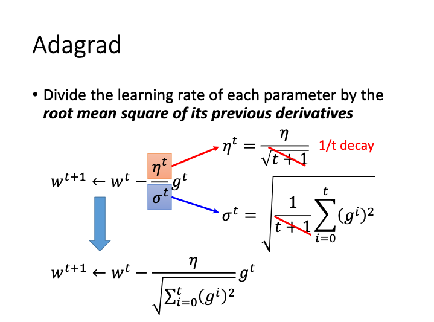

<!--
 * @Author: netor
 * @Date: 2020-04-20 17:01:49
 * @LastEditTime: 2020-04-20 17:53:26
 * @LastEditors: Please set LastEditors
 * @Description: In User Settings Edit
 * @FilePath: /CS-Note/MachineLearning_Hungyi_Lee-Note/SimpleVersion/Adagrad.md
 -->

# Adagrad

Adagrad 是一种调整 Learning Rate 的策略, 它是将每个 w 的学习率都除以其先前导数的均方根.

## Background

Q: 为什么需要调整每个 w 的 Learning Rate?
A: 若每个 w 的 Learning Rate 都是一样的,并且是固定的值,会导致如下图的情况.

如果 Learning Rate 太小了,那么下降的 Loss 下降的速度会很慢.

如果 Learning Rate 太大了, 当 Loss 到达某个极值点附近, 于是 Loss 的值会就在极值点附近反复左右横跳.

最好的策略是给每个 w 都有一个 Learning Rate, 并且 Learning Rate 是动态地慢慢变小.

## Adagrad Design

Eta 是 Learning Rate, g 是 Gradient, Sigma 是前面每次迭代的 g 的均方根.

