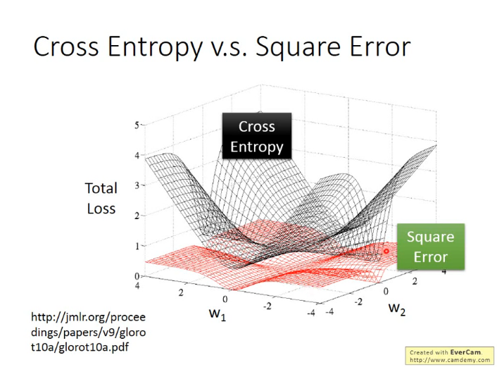
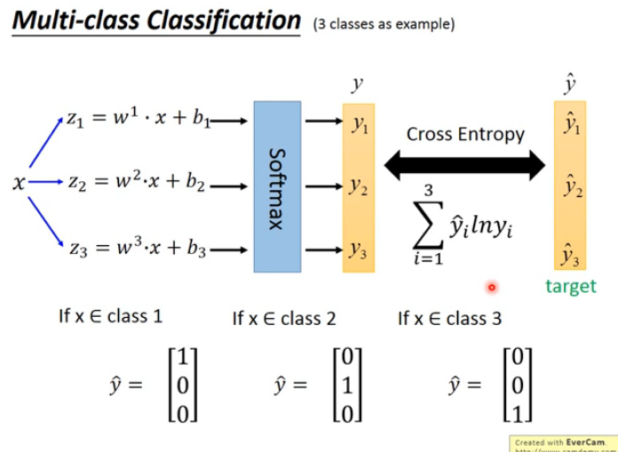
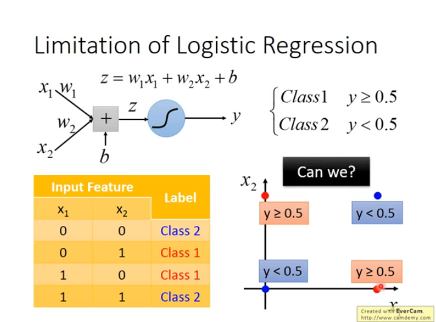
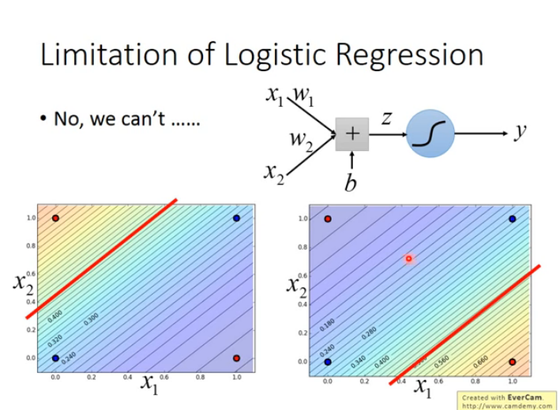
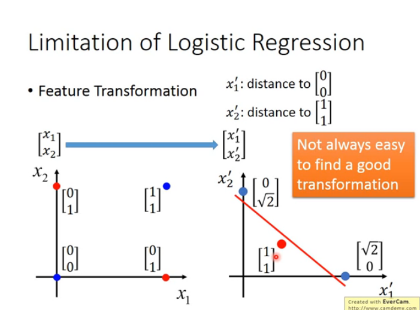
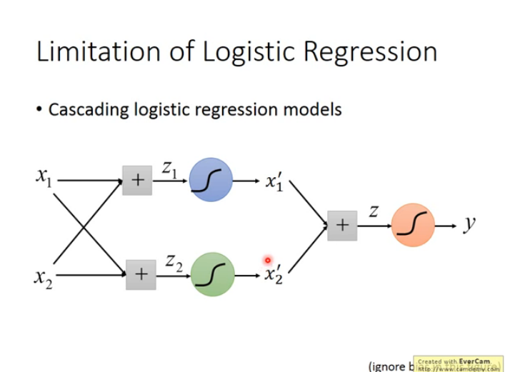

## Logistic Regression

Logistic Regression 的 Function Set: $f_{w,b}(x)=P_{w,b}(C_1|x)$ 代表的是所有 w,b 能够产生的 Function 集合起来的 Funtion Set.

Logistic Regression 使用的 Cost function 是 Cross Entropy,公式如下:

- $L(w,b)=\sum_n{-[\hat{y}^nlnf_{w,b}(x^1)+(1-\hat{y}^n)ln(1-f_{w,b}(x^n))}]$

Cross Entropy 原来的定义公式如下,q 和 p 分别是两个 Distribution

- $H(p,q)=-\sum_x{p(x)ln(q(x))}$(原定义公式)
- $p(x=1)=\hat{y}^n \rightarrow q(x=1)=f(x^n)$
- $p(x=0)=1-\hat{y}^n \rightarrow q(x=0)=1-f(x^n)$

|        | Logistic Regression                                                                                   | LinearRegression                               |
| ------ | ----------------------------------------------------------------------------------------------------- | ---------------------------------------------- |
| Setp 1 | $f_{w,b}(x)=\sigma(\Sigma_i{w_ix_i+b})$                                                               | $f_{w,b}(x)=\Sigma_i{w_ix_i+b}$                |
| -      | Output: Between 0 and 1                                                                               | Output: any value                              |
| Step 2 | Training data:$(x^n,\hat{y}^n)$                                                                       | Training data:$(x^n,\hat{y}^n)$                |
| -      | $\hat{y}^n$:1 for class 1, 0 for class 2                                                              | $\hat{y}^n$: a real number                     |
| -      | $L(f)=\Sigma_n(C(f(x^n),\hat{y}^n))$                                                                  | $L(f)=\frac{1}{2}\Sigma_n(f(x^n)-\hat{y}^n)^2$ |
| Step 3 | Logistic regression&Linear regression: $w_i\leftarrow w_i-\eta\Sigma_n-(\hat{y}^n-f_{w,b}(x^n))x_i^n$ |

## Cross Entropy v.s Square Error

Logistic Regression 使用的是 Cross Entropy 的损失函数,与 Linear Regression 的 Mean Square Error 的区别在于: 如图,MSE 在距离目标很远的地方也会很小,很平坦,那么 update 的速度十分慢,相反 CE 距离目标很远的时候就很大.

## Discriminative v.s. Generative

Logistic Regression 的方法称为 Discriminative 的方法,用 gaussian 描述 Probability Distribution 的方法称为 Generative 的方法

- $P(C_1|x)=\sigma(w*x+b)$

| Discriminative        | Generative                     |
| --------------------- | ------------------------------ |
| Directly find w and b | Find $\mu^1,\mu^2,\Sigma^{-1}$ |

Discriminative 和 Generative 的区别在于他们两者的内在假设不同,Discriminative 的方法没有做假设,在 Generative 的 Model 里面是有做假设的,比如假设他们是 Gaussian Distribution. 这就表示 Discriminative 的 Funtion Set 更大,所以在这个根据属性分类水系宝可梦的任务中,Discriminative 有更好的 Performance.

- Benefit of generative model
  - With the assumption of probability distribution, less training data is needed.
  - With the assumption of probability distribution, more robust to the noise
  - Priors and class-dependent probabilities can be estimated from different sources.

## Multi-class Classification

> 把 Logistic Regression 的结果值输出到由 0-1 表示的矩阵中.
> 使用 Softmax Layer,大的值和小的值拉得更开,放在输出层,作用是的使用结果更加明显,因为分类最后的结果是一个矩阵,矩阵中的每一维都代表的属于这个类的概率,所以每一维的值都在 0-1 之间,如果一个 x 的分类结果是 0.21 0.88,有点比较难做比较,而 Softmax Layer 的作用就是把 0.21 变得更小,比如小到接近 0,而把 0.88 变得更大,比如大到接近 1.
> 使用 Cross Entropy 把类 Scale 到 0-1 之间.

## Limitation of Logistic Regression

Logistic Regression 的 Boundery 就是一条直线,没法分割如下情况:

常用的解决方法 Feature Transformation:

另外的解决方法 Cascading Logistic Regression Model:

