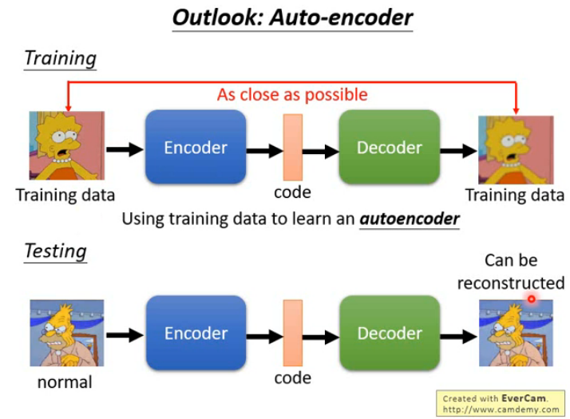

# Anomaly Detection

异常的数据不好取得,或者训练集中混杂了异常的数据,所以需要异常检测.

跟据任务目标的不同设置不同的 Cost 来进行一场侦测.

## Area under ROC curve

## Anomaly Generating by Generative Model

- Kimin Lee,Training Confidence-calibrated Classifiers for Detecting Out-of-Distribution Samples, ICLR2018
- Mark Kliger, Novelty Detection with GAN,arXiv, 2018

## Auto-encoder

## One-class SVM

## Isolated Forest
