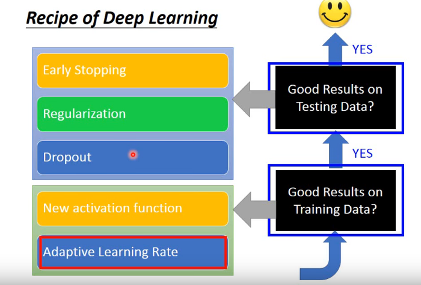
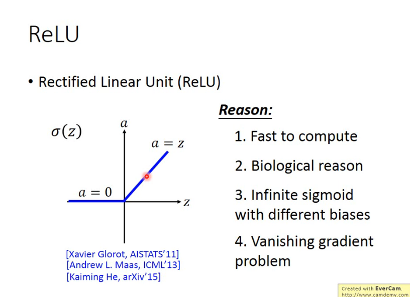
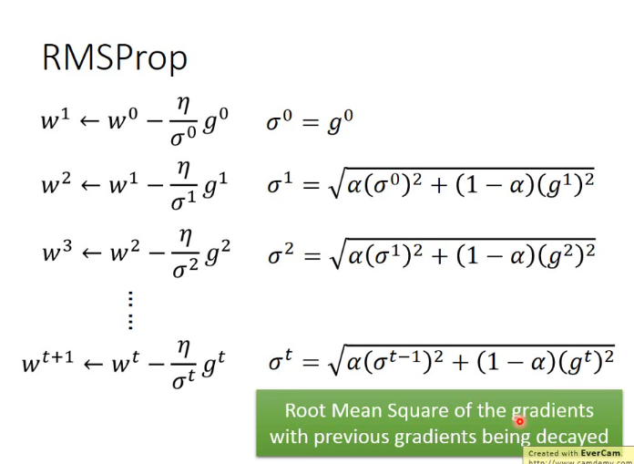
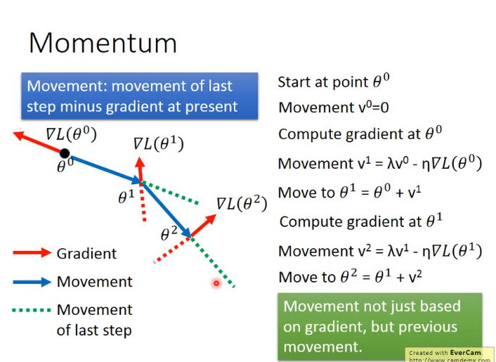

# Tips for Training DNN

## Vanishing Gradient Problem

当 layer 比较深的时候,当一个 NN 的 output layer 已经 converge 的时候,input layer 还是 Almost random.
换句话就是靠近 input layer 的地方学得慢,靠近 output layer 的的房学得快.
造成这个情况的原因是靠近 output layer 的地方有 Larger gradients,靠近 input layer 的地方有 Smaller gradients.

解决方法就是 ReLU

## Rectified Linear Unit(ReLU)

好处:

- Fast to compute
- Biological reason
- Infinite sigmoid with different biases(ReLu 其实是无限多个 Sigmoid 的叠加)
- Vanishing gradient problem(因为 Sigmoid Function 会强行把结果压缩到-1 到 1 之间)

## Rectified Linear Unit(ReLU) Variant

有两种,总的思路把就是把 ReLU 负的部分都不设置为其他值

- Leaky ReLU(负的部分设置为 0.01z)
- Parametric ReLU(负的部分设置为 αz)

## Maxout

Activation function 是自己学出来的

## RMSProp

比 Adagrad 更加智能的调整 Learning Rate 的方法

## Momentum

模仿物体中的运动,让 Gradient Descent 有惯性.

## RMSProp + Momentum = Adam

## Early Stopping

在 Validation set 和 Training set 的 Total Loss 快要分开的时候停止 Epochs

## Regularization

在 Loss Function 后面加个所有权值的范数(L1,L2),sgn 函数等等

## Dropout

每次 Update 的时候都丢掉一部分 Neuron(p%),相当于改变 network 的 structure.

在 Training set 的结果可能会变差, 但是在 Testing set 上的结果可能会变好.

在验证 Testing Set 的时候,如果在 Training 的时候 Dropout rate 等于一,那么在 testing 的时候必须把训练好的网络的 weight 与 50%相乘.

> Dropout 的 Intuitive Reason 是当一个人要训练的时候如果脚上榜上重物
