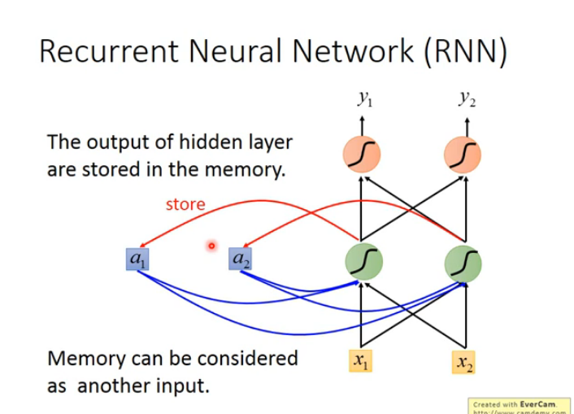
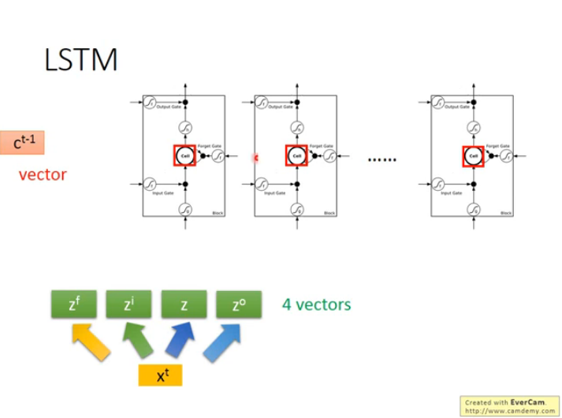
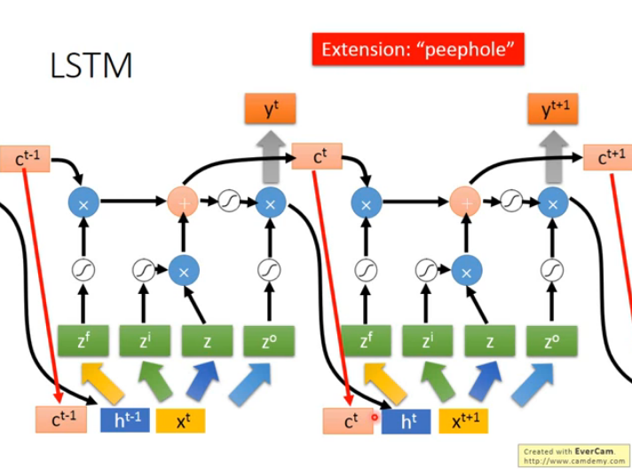

# Recurrent Neural Network

就是普通的 nerual network 加上一个 store unit,每当一个 input data x 和一个 nerual 进行计算之后得到输出 z,这时把输出 Z 付给 store unit.

下次再来一个 input new x, 把 store unit 的数据也当成输入进行计算,相当于输入和 store 拼接的起来,这时与 nerual 的 weight 相乘的输入变成了[x, store unit],这样一个拼接起来的矩阵.

- 当输入的顺序不同的时候 output 的
  值也会不同.
- 分为 Elman Network 和 Jordan Network
  - Elman Netwiork 是把 hidden layer 存到 store unit
  - Jordan Network 是把 output layer 存到 store unit
- Bidirectional RNN: 同时 train 一个正向的 RNN 和一个反向的 RNN,就是把输入的 x 顺序反过来,比如 train 一个 network 输入顺序为 x1,x2...xn,,再 train 一个 network,输入顺序为为 xn...x2,x1.得到两个 network 之后接到一个 output layer 之中得到最后的 y,注意这里两个 network 的接到 output layer 的输入是反过来的的,比如 network1 训练 x1 得到的结果 z1 是和 network2 训练完 xn...x2,x1 得到的结果进行拼接.
- Loss Function: BackPropagation Through Time(BPTT)
- 由于 menmory 被重复使用了多次,所以会有类似于蝴蝶效应的现象,比如 w=1.1 时经过多次更新 w 会变得很大,w=0.9 时经过多次更新 w 优惠变得很小,因此 RNN 的 Gradient 十分的崎岖,解决方法是 LSTM.

## Long Short-term Memory(LSTM)

有六个部分组成: Input, Input Gate, Forget Gate, Memory Cell, Output Gate, Output.

有相当于有一个 output,四个 input(Input, Input Gate, Forget Gate, Output Gate)

每个 Gate 也是一个用 x 和 w 相乘然后放入激活函数的方法,不过这里 x 中的每个 channel(或者说维度,参数)对应一个门,所以只一个 weight 控制一个门,并且 input x 必须起码在 4 个 channel 以上(4 维或以上的向量)

- LSTM 可以解决 Gradient Vanishing 的问题,但是不能解决 Gradient explode 的问题.
- LSTM 可以把 Learning Rate 设置的小一点.
- RNN 与 LSTM 的不同在于 RNN 的 Memory 在每次更新的时候都会被洗掉,而 LSTM 的 Memory 和 input 是相加的.RNN 的 memory 一旦被影响,则影响会被下一个时间点 Format 掉,LSTM 是 Forgate Gate 关闭了才会被 Format,所以必会有 Gradient Vanishing 的问题

## Gated Recurrnet Unit(GRU)

LSTM 的简化版,Gate 只有两个.

## Clockwise RNN, Structurally Constrained Recurrent Network(SCRN)

## RNN 的其他应用:

Input is a vector sequence, but output is only one vector

- Many to one(output is one vector)
- Many to Many(Output is short)
- Trimming 就是把重复的东西拿掉,但这样会有一个问题就是比如好棒棒这样的贬义词变成好棒这样的褒义词,解决方法是 Connectionist Temporal Classification(CTC)
- Many to Many(No Limitation)
- Beyond Sequence,Syntactic parsing(让 Model 开一个句子,输出树状的语法结构)
- Sequence-to-sequence Auto-encoder -Text
